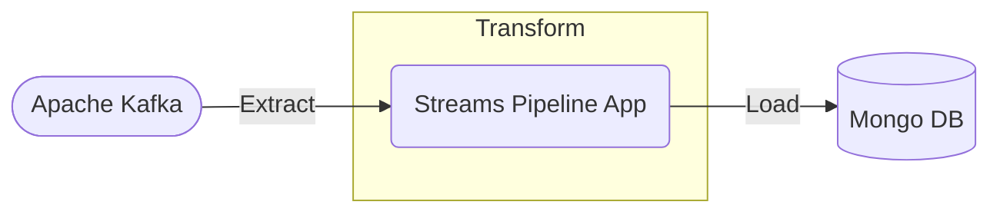
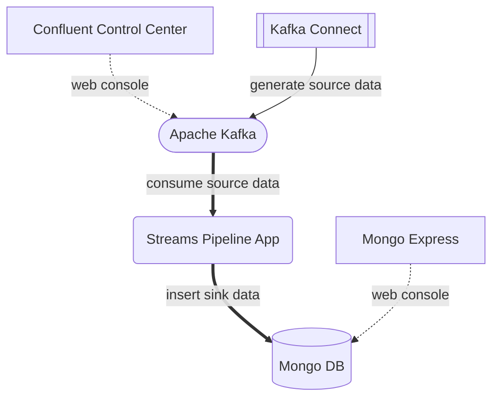

# Kafka Streams Pipeline

This streams pipeline application processes the messages from a topic of Apache Kafka into Mongo DB as ETL.



## Requirements

- Java 17

## Quick Start Usage

### 1. Build

Mac or Linux

```bash
./gradlew assemble
```

### 2. Run

Mac or Linux

```bash
java -jar ./app/build/libs/kafka-streams-pipeline-1.0.0-SNAPSHOT-all.jar
```

## Demo

run this app with containerized Apache Kafka and Mongo DB



### Additional Requirements

- Mac or Linux
- Docker

### Demo Setup

#### 1. Run Containers with Docker Compose

```bash
# Terminal 1
docker compose -f ./demo/docker-compose.yml up -d
```

#### 2. Create Topic in Apache Kafka

```bash
# Terminal 1
./demo/scripts/create-topic.sh
```

#### 3. Build Streams Pipeline App

```bash
# Terminal 2
./gradlew assemble
```

#### 4. Run Streams Pipeline App

```bash
# Terminal 2
java -jar ./app/build/libs/kafka-streams-pipeline-1.0.0-SNAPSHOT-all.jar
```

#### 5. Generate Source Data into Topic of Apache Kafka

```bash
# Terminal 1
./demo/scripts/create-datagen.sh
```

#### 6. Observe Pipeline Processing

- see the sink data on the web console: 'Mongo Express'

    http://localhost:18081/db/pipelineSink/pizzaOrderAnalysis/

- see also the source data on the web console: 'Confluent Control Center'

    http://localhost:9021/clusters/

        controlcenter.cluster > Topics > pizzaOrders > Messages

- see also the logs of 'Streams Pipeline App' in Terminal 2

### Demo Cleanup

#### 1. Terminate Generating Source Data

```bash
# Terminal 1
./demo/scripts/delete-datagen.sh
```

#### 2. Terminate Streams Pipeline App

- Terminal 2

    push the key: `ctrl+C`

#### 3. Terminate Containers with Docker Compose

```bash
# Terminal 1
docker compose -f ./demo/docker-compose.yml down -v --rmi all
```

## See Also

- [KEDA Auto Scalable Pipeline (my another repository in GitHub)](https://github.com/ogi-iii/keda-auto-scalable-pipeline)
    - horizontally parallelizes this streams pipeline application based on an event-driven autoscaler with KEDA
